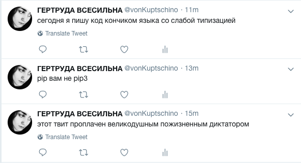

# Lab-Report

 2.1. Разработка классов и объектов «запись», «комментарий» для приложения «Блог» (наследование) [NachKomm.py](./NachKomm.py)
 
 ```python 
 class Nachricht(object): #класс Запись

    def __init__(self, Autor, Zeitmark, Inhalt):
        self.Autor = Autor  #Автор
        self.Zeitmark = Zeitmark  #Дата
        self.Inhalt = Inhalt  #Содержание записи

class Kommentar(Nachricht):   #класс Комментарий наследует класс Запись (у комментария тоже есть Автор, Дата и Содержание
	
    def _machenPublik(self, istPublik):
        self._istPublik = true  #флаг публичности комментария (по умолчанию true - виден всем)
 ```
     
 2.2. Создание геттеров и сеттеров для классов «запись», «комментарий» приложения «Гостевая книга». Создание функций для вывода на печать информации, хранящийся в объектах. [gsNachKomm.py](./gsNachKomm.py)
 
 ```python
class Nachricht(object):

    def __init__(self, Autor, Zeitmark, Inhalt):
        self.Autor = Autor
        self.Zeitmark = Zeitmark
        self.Inhalt = Inhalt
    #функции печати пропертей
    def druckenAutor(self):
    	print(f'Autor: {self.Autor.Name}')

    def druckerInhalt(self):
    	print(f'Inhalt: {self.Inhalt}')

class Kommentar(Nachricht):

	def __init__(self):
		self._istPublik = 1

	istPublik = property()

	@istPublik.getter     #геттер - получает значение флага публичности
	def istPublik(self):
		return self._istPublik

	@istPublik.setter     #сеттер - задаёт значение флага публичности
	def istPublik(self, value):
	    self._istPublik = value
```
3.4 Разработка скрипта для получения и сохранения данных социальных сетей Twitter или Instagram.
Я немного зменила задание и написала бота-флудера, способного постить в мой персональный твиттер-аккаунт через определённый промежуток времени. 

Для написания скрипта я использовала бибиотеку __tweepy__ и персональные ключи и токены, которые получила, когда Твиттер подтвердил мой аккаунт разработчика
```python
tweets = ['этот твит проплачен великодушным пожизненным диктатором', 
	  'pip вам не pip3',
	  'сегодня я пишу код кончиком языка со слабой типизацией' ]
for tweet in tweets:
    status = api.update_status(tweet)
    time.sleep(120)  #промежуток 120 секунд
```

